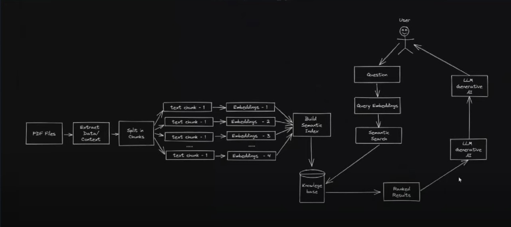

# RAG Application for English Notebook

## Introduction

Welcome to the Retrieval Augmented Generation (RAG) Application for English Notebook! This application harnesses the capabilities of RAG models to enrich your experience with English notebook content. This README offers an overview of the code structure and functionality of the application.

## Code Structure

The codebase is organized into several modules, each serving a distinct purpose within the RAG application:

1. **Data Loading Module**
   - This module is responsible for loading data from notebook files.
   - It provides functions to import data from various formats and directories.

2. **Text Preprocessing Module**
   - This module preprocesses the loaded text data, performing tasks such as cleaning and tokenization.
   - Its goal is to ensure that the text data is in an appropriate format for further processing.

3. **RAG Model Module**
   - This module implements the RAG model for retrieval-based question answering and text generation.
   - It leverages pre-trained RAG models and fine-tuning mechanisms tailored to specific tasks.

4. **User Interface Module (ChainLit)**
   - This module offers a user-friendly interface using ChainLit, a library for building conversational AI applications.
   - ChainLit provides tools for creating chat interfaces, handling user input, and generating responses using RAG models.

## Model Architecture

